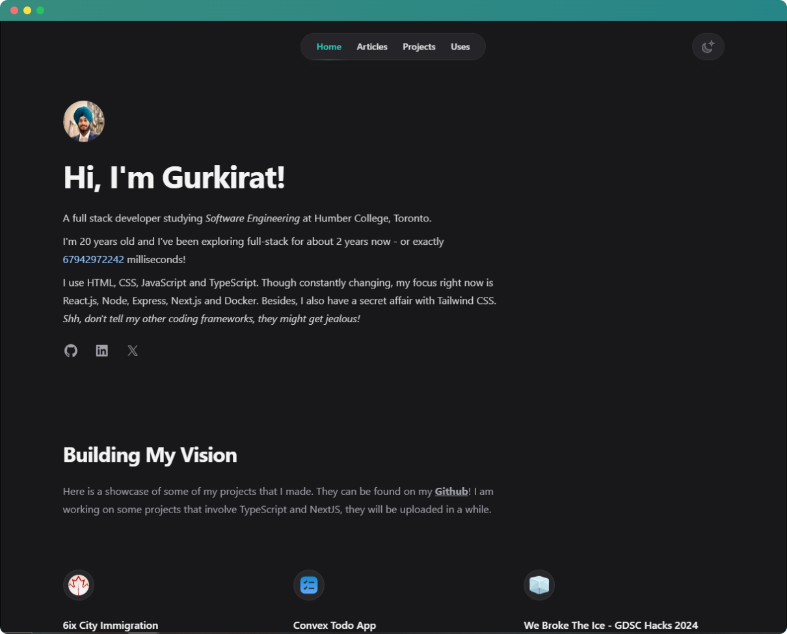

<h1 align="center">
  gurkiratz.co
</h1>
<p align="center">
  The first iteration of <a href="https://gurkiratz.co" target="_blank">gurkiratz.co</a> built with <a href="https://nextjs.org/" target="_blank">Next.js</a> and <a href="https://mdxjs.com/" target="_blank">MDX</a> and hosted on <a href="https://vercel.com/" target="_blank">Vercel</a>
</p>

<div align="center">
  
</div>

<p align="center">
Crafted with <span style="color: #8b0000;">&hearts;</span> by Gurkirat Singh. Template by <a href="https://tailwindui.com" target="_blank">Tailwind UI</a>
</p>

# Spotlight

Spotlight is a [Tailwind UI](https://tailwindui.com) site template built using [Tailwind CSS](https://tailwindcss.com) and [Next.js](https://nextjs.org).

## 🛠 Installation & Set Up

1. Install the npm dependencies:

```bash
npm install
```

2. Next, create a `.env.local` file in the root of your project and set the `NEXT_PUBLIC_SITE_URL` variable to your site's public URL:

```
NEXT_PUBLIC_SITE_URL=https://example.com
```

3. Next, run the development server:

```bash
npm run dev
```

Finally, open [http://localhost:3000](http://localhost:3000) in your browser to view the website.

## License

This site template is a commercial product and is licensed under the [Tailwind UI license](https://tailwindui.com/license).
